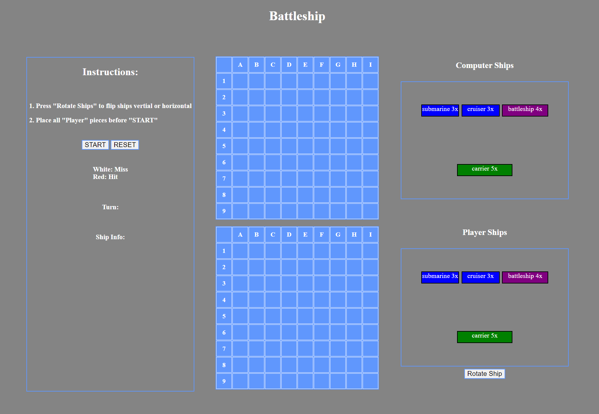

# Battleship

### In main.css, change .invisible background-color to show computer ships.

My Battleship is a guessing game played by two users: player vs the computer. Both users will secretly place ships of varying lengths on their respective grids. Each user will take turns shooting at the opponent's grid trying to hit their hidden ships. The first user to destroy all of the opponent's ships is the winner.

Unlike my browser-based game, the original Battleship is played by two players. Each player also has an additional ship called a destroyer and it has a length of 2 cells. When a player hits an opponent's ship, the opponent calls out "hit". The rest of the game is the same.

### Images of the game

#### Initial load:

#### Rotated and placed ships:

#### Both players attack: sunk computer's battleship

#### Winning screen:

### Technologies used

1. Javascript
2. CSS
3. HTML

### Getting Started

#### Rules:

The game rules are very simple.

1. Place all player ships
2. When dragging and dropping to place the ships, the ship is dropped starting from where you let go. The dragging animation is decieving -> DO NOT RELY ON IT!
3. Press the 'start' button
4. Click on computer's grid and try to sink all ships. Make sure to wait for your turn indicated on the left hand display -> PLAYER'S TURN

Click on this link to play the game!
https://bsong1124.github.io/Project-1-Browser-Based-Game/

### Future features

1. Enhance computer's AI to check cells next to a 'hit'
2. Style the game better
   - graphic background
   - graphic ships
   - animations
3. Better winner screen
